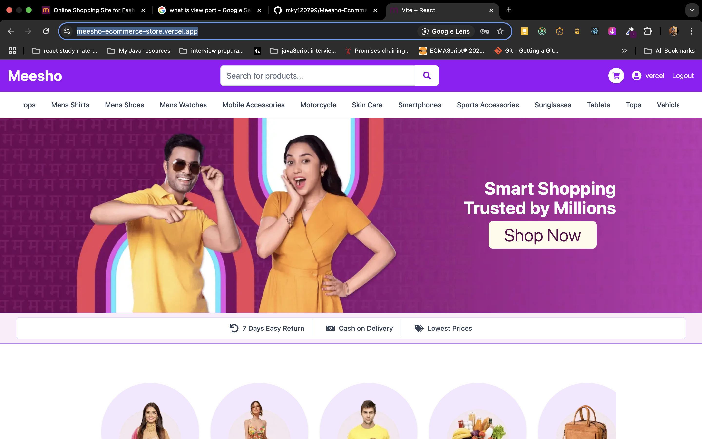

# 🛍️ Meesho Clone (Frontend)

A responsive and feature-rich e-commerce platform frontend built with **React**, **Tailwind CSS**, and **Vite**, inspired by [Meesho](https://www.meesho.com/). It simulates a shopping experience complete with product listing, filtering, category browsing, search functionality, infinite scrolling, and more.

> 🚀 This is a frontend-only project designed for learning and showcasing modern React development.

## Access the live demo: [Meesho Clone Demo](https://meesho-ecommerce-store.vercel.app/)

## ✨ Features

- Fully responsive design for mobile, tablet, and desktop
- Dynamic product listing with infinite scroll
- Category-based filtering using checkboxes
- Search functionality to filter products by title
- Mobile hamburger menu with toggle support
- Custom hero section with CTA
- Styled using Tailwind CSS and utility-first approach
- Product detail layout with image overlays and transitions

## 🖥️ Tech Stack

- **React**
- **Vite**
- **Tailwind CSS**
- **React Router**
- **Redux Toolkit**
- **React Icons**
- **DummyJSON API** for mock data

## 📦 Installation

```bash
git clone https://github.com/your-username/meesho-clone.git
cd meesho-clone
npm install
```

## 🧪 Running Locally

```bash
npm run dev
```

Visit `http://localhost:5173` in your browser.

## 🚀 Build for Production

```bash
npm run build
```

This will generate a `dist/` folder with production-ready assets.

## 🧾 Folder Structure

```
meesho-clone/
├── public/
├── src/
│   ├── assets/
│   ├── components/
│   ├── pages/
│   ├── redux/
│   └── App.jsx
├── index.html
├── tailwind.config.js
└── vite.config.js
```

## 🌐 Deployment

This app is deployable on vercel.

## 📸 Demo (Optional)




## 🙏 Acknowledgements

- [Meesho Website](https://www.meesho.com/)
- [DummyJSON API](https://dummyjson.com/)
- [Tailwind CSS Docs](https://tailwindcss.com/)
- [React Router Docs](https://reactrouter.com/)

## 📄 License

This project is licensed under the MIT License.